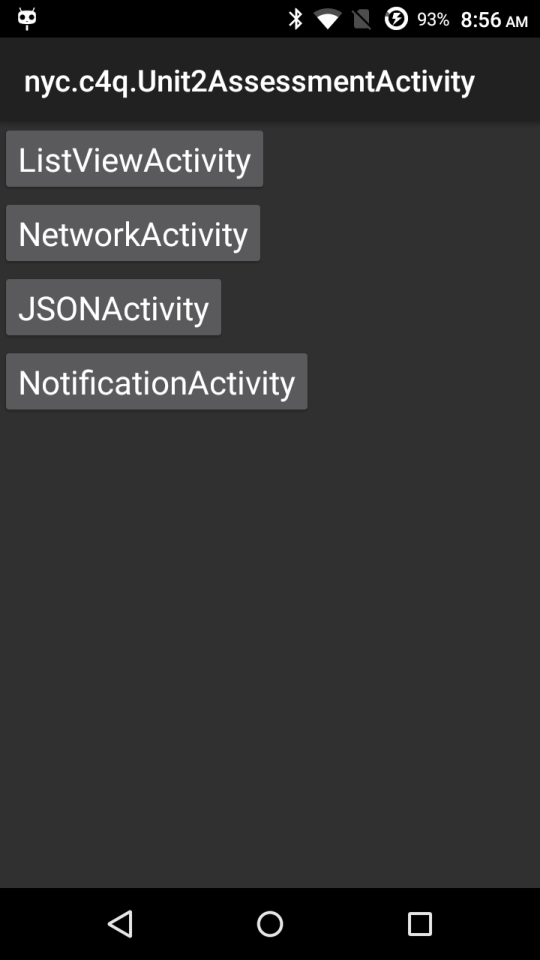
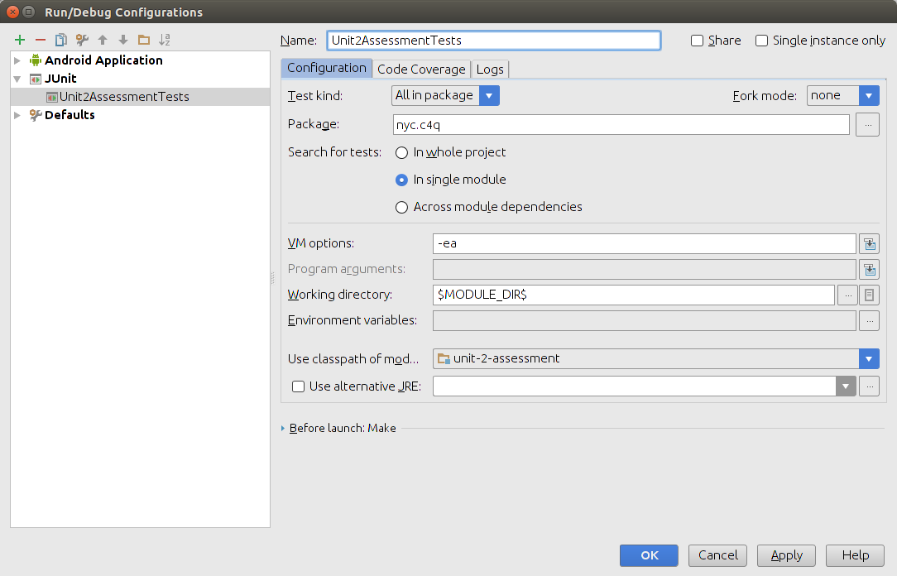

## Unit 2 Assessment Test
This is designed to run with Android Studio with
[Unit Testing support](https://sites.google.com/a/android.com/tools/tech-docs/unit-testing-support) enabled in Android Studio's Gradle settings.

Watch what this app does here: 

> 

### Importing
Import the project into Android Studio by selecting `Import Project` and selecting the project's `build.gradle`. When prompted, you can pick the default gradle wrapper.

### Running Tests
To run the test , open Android Studio's [Build Variants](https://sites.google.com/a/android.com/tools/tech-docs/unit-testing-support/qSxL68MPv5.png) pane and change the option `Test Artifact` to `Unit Tests`. You can then right click on `Unit1AndroidAssessmentTests` and run the tests.

Your run configuration should look like this:

> .

### NetworkActivityTests

You can run the following commands in the terminal with the [curl](https://developer.apple.com/library/mac/documentation/Darwin/Reference/ManPages/man1/curl.1.html) command.

HTTP GET request we'll be using: 

    $ curl "https://httpbin.org/get?custname=james+dean&custtel=347-841-6090&custemail=hello%40c4q.nyc&size=small&topping=cheese&delivery=18%3A15&comments=Leave+it+by+the+garage+door.+Don%27t+ask+any+questions."

HTTP POST request we'll be using:

    $ curl -X POST \
        -d "custname=james dean" \
        -d "custtel=347-8431-6090" \
        -d "custemail=hello@c4q.nyc" \
        -d "size=small" \
        -d "topping=cheese" \
        -d "delivery=22:15" \
        -d "comments=Leave it by the garage door. Don't ask any questions." \
        https://httpbin.org/post

